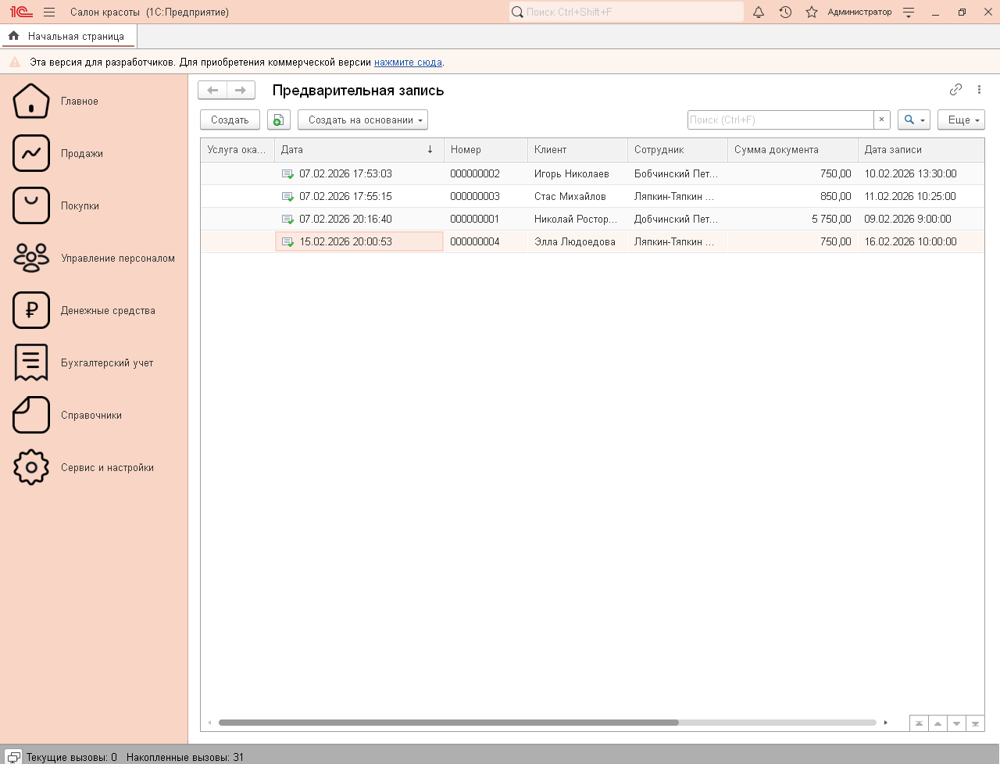

# Экосистема автоматизации салона красоты «BeautySalon»

Проект представляет собой комплексное решение для автоматизации бизнес-процессов салона красоты. Система состоит из двух независимых конфигураций 1С, взаимодействующих между собой в режиме реального времени.

## 📱 Архитектура системы

Проект разделен на логические блоки:
1. **`1c-desktop-src`** — Основная (back-end) конфигурация для настольного ПК (рабочее место администратора/директора).
2. **`1c-mobile-src`** — Мобильное приложение (front-end) для клиентов или мастеров салона.

Обмен данными и синхронизация реализованы по протоколу HTTP посредством **собственных HTTP-сервисов**, развернутых на стороне основной базы.

---

## 🚀 Ключевой функционал и примененные технологии

### Основная база (Desktop):
* **Учет и управление:** Ведение базы клиентов, графиков работы мастеров, учет расходных материалов и услуг.
* **Интеграция (HTTP-сервисы):** Реализован кастомный REST API для обработки запросов от мобильного приложения (авторизация, получение списка доступных услуг/мастеров, запись на сеанс).
* **Безопасность:** Разграничение прав доступа, кастомный механизм авторизации и проверки сессий.
* **Аналитика:** Разработаны управленческие отчеты на базе **Системы компоновки данных (СКД)** для анализа выручки и загрузки мастеров.

### Мобильное приложение (Mobile):
* **Интерфейс:** Адаптивные управляемые формы под мобильные устройства.
* **Автономия:** Работа с локальными данными и отправка изменений на сервер через асинхронные HTTP-запросы в формате **JSON**.

---

## 🛠 Демонстрация интерфейса (Скриншоты)

> *Совет: замените ссылки ниже на реальные скриншоты вашего проекта после их загрузки в репозиторий*

### Основная база (Рабочее место администратора)

### Мобильное приложение

  
  

---

## 💻 Пример реализации API (HTTP-сервис)

Для интеграции мобильного приложения с основной базой разработан REST API. Проверка пользователя выполняется с помощью **GET-запроса**, где логин передается в качестве параметра URL-строки.

Серверная часть обрабатывает запрос, проверяет наличие сотрудника/клиента в базе данных 1С и возвращает массив с данными пользователя в формате JSON.

**GET-запрос на проверку пользователя:** ' GET /salon/hs/users/getUser?username=Администратор'

**Пример успешного ответа от сервера:**
{
  "guid": "092468ac-0c83-11f1-a50d-00e0240c2125",
  "name": "Администратор",
  "code": "a24766b0-9e76-4701-a54c-268af14faa55"
}